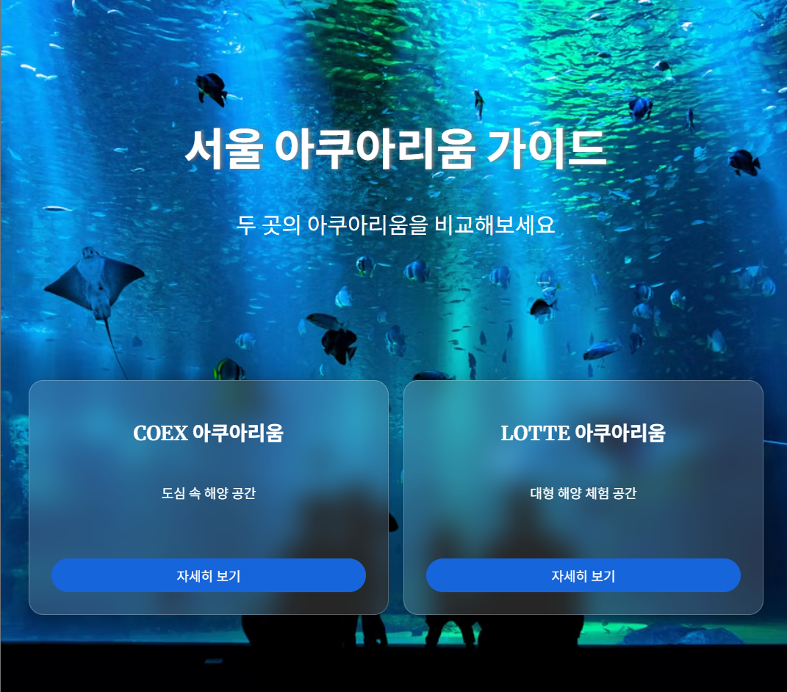

# web-team-project
이 프로젝트는 HTML, CSS, JavaScript를 활용하여 웹 페이지를 제작하는 팀 협업 실습 프로젝트 입니다.

## 1. 프로젝트 소개 및 설정 이유
HTML, CSS, JavaScript를 활용하여 웹 페이지를 제작하는 팀 협업 실습 프로젝트입니다.
공통의 관심사를 기반으로, 수업에서 학습한 웹 개발의 기본 구성요소와 기술들을 적용할 수 있는 주제를 찾아보았고
'서울의 수족관'들을 소개하는 페이지를 제작하는 아이디어가 채택되었습니다.

-메인 이미지


## 2. 사용기술
- HTML5
- CSS3
- Git
- GitHub

## 3. 팀원 역할
|  이름  |       담당 영역          |
|--------|--------------------------|
| 한진형 | 아쿠아리움 개별 정보 페이지 |
| 문혜원 | 홈, 해양 생물 갤러리 페이지 |

## 4. 브랜치 전략
main 브랜치는 최종 결과물을 관리하는 브랜치입니다.
각 팀원은 기능별 브랜치를 생성하여 작업합니다.
- 브랜치 이름은 다음과 같습니다.
```bash
feature/index&gallery
feature/coex&lotte
```

